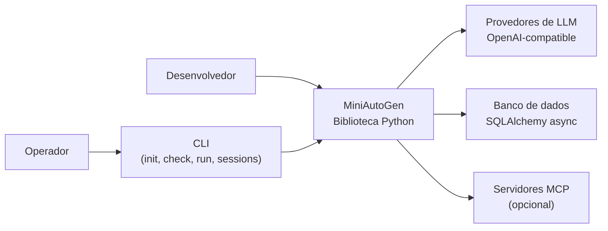

# C4 Nível 1: Contexto do Sistema

## Visão geral

O MiniAutoGen é uma biblioteca Python para construção de sistemas de coordenação multiagente com pipelines assíncronos. Fornece blocos de construção tipados para hospedar agentes, coordenar colaboração através de modos estruturados (workflow, deliberação, loop agêntico), persistir estado e integrar modelos de linguagem. O MiniAutoGen não é uma aplicação pronta para uso final --- é um toolkit de composição consumido por outra aplicação Python.

## Responsabilidades do sistema

- Coordenar execução multiagente através de modos de coordenação tipados (workflow, deliberação, loop agêntico, composição).
- Gerir o ciclo de vida de execução com eventos, policies e propagação de contexto.
- Persistir conversas, metadados de execução e checkpoints de estado.
- Integrar provedores de LLM através de adaptadores tipados por protocolo.
- Disponibilizar CLI para scaffolding de projetos, validação, execução de pipelines e gestão de sessões.

## Atores e sistemas externos

### Desenvolvedor da aplicação

Monta a solução usando os módulos do MiniAutoGen. Define agentes, planos de coordenação, backends, stores e o ciclo de execução assíncrono.

### Operador

Interage com o sistema via CLI (init, check, run, sessions) ou através de aplicações construídas sobre o MiniAutoGen.

### Provedores de LLM

Sistemas externos acessados via endpoints HTTP compatíveis com a API OpenAI. Inclui OpenAI, Gemini CLI gateway, LiteLLM, vLLM e Ollama.

### Banco de dados

Sistema externo opcional utilizado pelos stores SQLAlchemy para persistência durável de mensagens, execuções e checkpoints. O padrão é SQLite via aiosqlite, mas qualquer URL compatível com SQLAlchemy async é aceita.

## Diagrama de contexto

## Relações principais

| Origem | Destino | Relação |
| --- | --- | --- |
| Desenvolvedor | MiniAutoGen | Configura agentes, planos de coordenação, stores e backends |
| Operador | CLI | Executa comandos de scaffolding, validação, execução e gestão de sessões |
| MiniAutoGen | Provedores de LLM | Envia requisições via protocolo OpenAI-compatible para geração de respostas |
| MiniAutoGen | Banco de dados | Persiste e consulta mensagens, metadados de execução e checkpoints |
| MiniAutoGen | Servidores MCP | Integra ferramentas externas via protocolo MCP (opcional) |

## Limite do sistema

O limite do sistema inclui somente o pacote `miniautogen` e seus contratos internos. Scripts de exemplo, testes, CLI gateway e a aplicação hospedeira ficam fora do limite principal.
