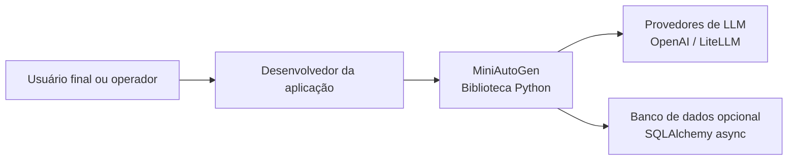

# C4 Nível 1: Contexto do Sistema

## Visão geral

O MiniAutoGen é uma biblioteca Python para construção de conversas multiagentes orientadas por pipelines assíncronos. Seu papel é oferecer blocos reutilizáveis para que uma aplicação hospede agentes, coordene turnos de conversa, persista mensagens e integre modelos de linguagem.

O sistema não é uma aplicação final pronta. Ele funciona como um kit de composição usado por outra aplicação ou script Python.

## Responsabilidades do sistema

- manter um conjunto de agentes participantes de uma conversa;
- registrar e recuperar mensagens por meio de um repositório abstrato;
- coordenar rodadas de execução com um administrador de chat;
- delegar a geração de respostas para pipelines configuráveis;
- integrar provedores de LLM para respostas automáticas.

## Atores e sistemas externos

### Desenvolvedor da aplicação

É quem monta a solução usando os módulos do MiniAutoGen. Define agentes, pipelines, repositórios, clientes LLM e o ciclo de execução.

### Usuário final ou operador

Interage indiretamente com a solução construída sobre o MiniAutoGen. Em cenários com `UserResponseComponent`, pode fornecer entradas pelo terminal.

### Provedor de LLM

Sistema externo acessado pelos clientes em `miniautogen.llms.llm_client`. Pode ser OpenAI diretamente ou qualquer provedor suportado via LiteLLM.

### Banco de dados

Sistema externo opcional usado por `SQLAlchemyAsyncRepository` para persistir mensagens de forma assíncrona. No estado atual, o padrão é SQLite com `aiosqlite`, mas a implementação foi desenhada para aceitar outras URLs compatíveis com SQLAlchemy async.

## Diagrama de contexto

## Relações principais

| Origem | Destino | Relação |
| --- | --- | --- |
| Desenvolvedor da aplicação | MiniAutoGen | Configura agentes, pipelines, repositórios e orquestra o uso da biblioteca |
| MiniAutoGen | Provedores de LLM | Solicita respostas para prompts preparados no pipeline |
| MiniAutoGen | Banco de dados opcional | Persiste e consulta histórico de mensagens |

## Limite do sistema

O limite do sistema inclui somente os módulos do pacote `miniautogen` e seus contratos internos. Scripts de exemplo, testes e a aplicação hospedeira ficam fora do limite principal, embora ajudem a ilustrar seu uso.
