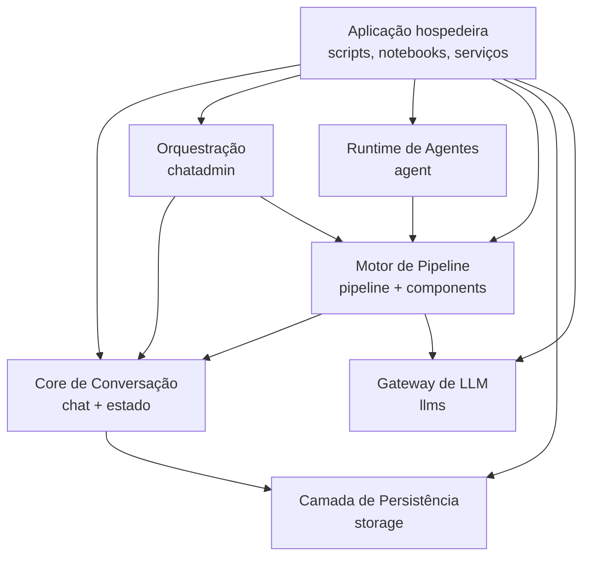

# C4 Nível 2: Containers Lógicos

## Visão geral

Como o MiniAutoGen é uma biblioteca, seus containers são melhor entendidos como agrupamentos lógicos de responsabilidade dentro do mesmo pacote Python.

## Diagrama de containers

## Containers

### Aplicação hospedeira

Não faz parte do pacote principal, mas é onde a biblioteca ganha vida. Instancia objetos, monta pipelines e inicia o fluxo assíncrono.

### Core de Conversação

Representado principalmente por `miniautogen.chat.chat` e `miniautogen.schemas`.

Responsabilidades:

- manter a lista de agentes de uma conversa;
- adicionar e recuperar mensagens por meio de `ChatRepository`;
- manter um `ChatState` local com contexto e mensagens;
- servir como ponto de acesso compartilhado para componentes do pipeline.

### Orquestração

Representada por `miniautogen.chat.chatadmin`.

Responsabilidades:

- iniciar e encerrar o loop de execução;
- controlar rodadas com `max_rounds`;
- montar o `ChatPipelineState` inicial da rodada;
- executar o pipeline administrativo.

### Runtime de Agentes

Representado por `miniautogen.agent.agent`.

Responsabilidades:

- encapsular identidade e papel do agente;
- vincular um pipeline ao agente;
- delegar a geração de resposta ao pipeline associado;
- expor construção a partir de JSON.

### Motor de Pipeline

Representado por `miniautogen.pipeline.pipeline` e `miniautogen.pipeline.components`.

Responsabilidades:

- executar componentes em sequência;
- transportar estado mutável entre componentes;
- permitir extensão por composição;
- implementar blocos prontos para entrada humana, seleção de agente, resposta, terminação, template e chamada LLM.

### Camada de Persistência

Representada por `miniautogen.storage`.

Responsabilidades:

- abstrair o armazenamento de mensagens;
- fornecer implementação em memória para testes e execuções simples;
- fornecer implementação SQL assíncrona para persistência durável.

### Gateway de LLM

Representado por `miniautogen.llms.llm_client`.

Responsabilidades:

- padronizar o contrato de chamada de modelos;
- integrar OpenAI diretamente;
- integrar qualquer backend suportado pelo LiteLLM.

## Observações de desenho

- O fluxo da biblioteca é orientado a composição, não a herança profunda.
- `ChatAdmin` herda de `Agent`, mas atua como coordenador da rodada e não como participante comum.
- O pipeline é o principal mecanismo de extensão comportamental da solução.
