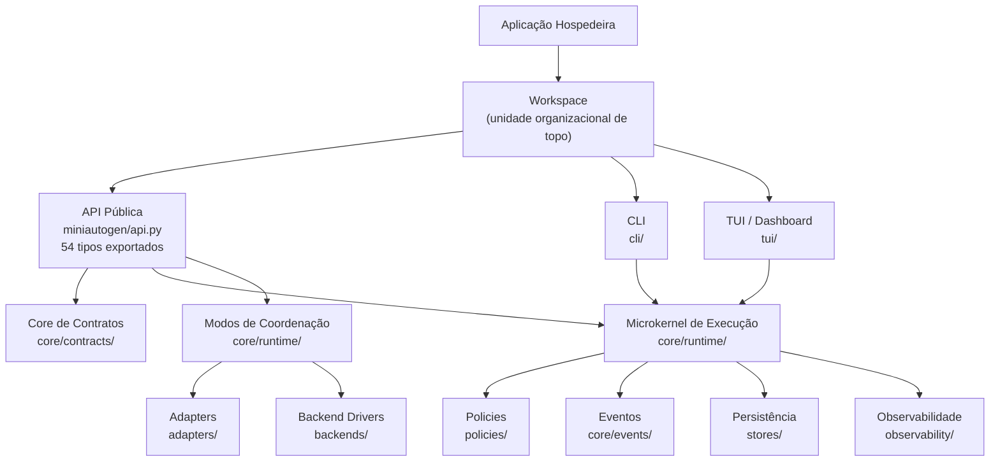

# C4 Nível 2: Containers Lógicos

## Visão geral

Como o MiniAutoGen é uma biblioteca, seus containers são agrupamentos lógicos de responsabilidade dentro do mesmo pacote Python. A arquitetura segue o padrão microkernel com camadas concêntricas que protegem o domínio central das integrações de infraestrutura.

## Diagrama de containers

## Containers

### Workspace

O **Workspace** é o container de topo que engloba toda a organização de um projeto MiniAutoGen. Substitui o antigo conceito de "Project" (ver [DA-9](06-decisoes.md#da-9)). Um Workspace:

- Contém a configuração global (`miniautogen.yml`), agentes registados, flows e estado de sessão.
- Expõe capacidades de Server/Gateway para integrações externas (endpoints HTTP, MCP bindings).
- É a fronteira de isolamento: cada Workspace possui o seu próprio registro de agentes, engines e stores.

A aplicação hospedeira interage com o Workspace, que por sua vez delega à API pública e às interfaces de utilizador (CLI e TUI).

---

### Aplicação hospedeira

Não faz parte do pacote. É a aplicação Python que consome o MiniAutoGen como dependência. Instancia objetos, configura planos de coordenação, registra agentes e engines, e inicia a execução assíncrona.

---

### API pública

**Módulo:** `miniautogen/api.py`

Ponto de entrada único para consumidores externos. Exporta 54 tipos organizados em categorias: contratos do core, protocolos de agentes, runtimes, flow, policies, eventos, observabilidade, stores e backend drivers. Toda importação externa deve partir deste módulo.

---

### Core de contratos

**Diretório:** `core/contracts/`

Contém mais de 30 modelos Pydantic e definições de Protocol que formam o vocabulário tipado do sistema. Entidades centrais: Message, RunContext, RunResult, ExecutionEvent, AgentSpec. Define três protocolos de agente:

- **WorkflowAgent:** expõe `process()` para execução sequencial de tarefas.
- **DeliberationAgent:** expõe `contribute()` e `review()` para revisão em pares.
- **ConversationalAgent:** expõe `reply()` e `route()` para turnos conversacionais.

Planos de coordenação (WorkflowPlan, DeliberationPlan, AgenticLoopPlan) descrevem a estrutura de cada modo de execução.

---

### Microkernel de execução

**Diretório:** `core/runtime/`

O PipelineRunner é o único executor oficial do sistema. Utiliza AnyIO para concorrência estruturada com suporte a cancelamento e timeouts. Responsabilidades:

- Enforcement de timeout e propagação de cancelamento.
- Emissão de eventos em cada transição do ciclo de vida.
- Persistência de checkpoints para recuperação de sessão.
- Gates de aprovação antes de ações críticas.

---

### Modos de coordenação

**Diretório:** `core/runtime/`

Quatro runtimes implementam o protocolo CoordinationMode:

- **WorkflowRuntime:** executa passos sequenciais ou paralelos com síntese opcional ao final.
- **DeliberationRuntime:** coordena múltiplas rodadas de revisão por pares com consolidação por líder.
- **AgenticLoopRuntime:** turnos conversacionais dirigidos por router, com deteção de estagnação.
- **CompositeRuntime:** encadeia múltiplos modos em sequência, permitindo composições complexas.

---

### Camada de policies

**Diretório:** `policies/`

Oito policies operam lateralmente como preocupações transversais:

| Policy | Responsabilidade |
| --- | --- |
| BudgetPolicy | Controle de orçamento por tokens ou custo |
| ApprovalPolicy | Gates de aprovação humana ou automática |
| RetryPolicy | Retentativas com backoff configurável |
| TimeoutScope | Enforcement de limites temporais |
| ValidationPolicy | Validação de entradas e saídas |
| PermissionPolicy | Controle de permissões por agente ou ação |
| ExecutionPolicy | Orquestração de múltiplas policies em sequência |
| PolicyChain | Composição de policies com avaliação encadeada |

Policies observam eventos e reagem. Não reescrevem a semântica do domínio.

---

### Camada de adapters

**Diretórios:** `adapters/`, `backends/`

Integrações com sistemas externos, isoladas do domínio por protocolos tipados.

**Provedores de LLM** (`adapters/llm/`):
- OpenAICompatibleProvider: cliente genérico para qualquer endpoint compatível com a API OpenAI.
- LiteLLMProvider: cliente via biblioteca LiteLLM.
- OpenAIProvider: cliente direto para a API OpenAI.

**Templates** (`adapters/templates/`):
- Jinja2Renderer: renderização de prompts via Jinja2.

**Backend Drivers** (`backends/`):
> Nota: Backend Drivers implementam o conceito de **Engine** definido no README estratégico. O nome do módulo `backends/` é mantido por compatibilidade de código.

- AgentDriver: classe abstrata base para drivers de backend.
- AgentAPIDriver: implementação HTTP para endpoints OpenAI-compatible (Gemini CLI gateway, LiteLLM, vLLM, Ollama).
- BackendResolver: instanciação de drivers a partir de configuração.

---

### Camada de persistência

**Diretório:** `stores/`

Cinco tipos de store com duas implementações cada:

| Store | InMemory | SQLAlchemy |
| --- | --- | --- |
| MessageStore | Sim | Sim |
| RunStore | Sim | Sim |
| CheckpointStore | Sim | Sim |
| EffectJournal | Sim | Sim |
| EventStore | Sim | Sim |

O domínio comunica exclusivamente com protocolos de store. Os detalhes de infraestrutura (SQL, serialization) ficam encapsulados nas implementações concretas. O backend SQLAlchemy suporta SQLite (via aiosqlite) e PostgreSQL.

---

### Observabilidade

**Diretórios:** `observability/`, `core/events/`

O sistema emite 63+ tipos de evento distribuídos em 13 categorias:

| Categoria | Quantidade | Exemplos |
| --- | --- | --- |
| Ciclo de vida da execução | 5 | run_started, run_finished, run_failed |
| Componentes | 4 | component_started, component_finished |
| Ferramentas | 3 | tool_invoked, tool_succeeded |
| Armazenamento | 2 | checkpoint_saved, checkpoint_restored |
| Adapters | 1 | adapter_failed |
| Policies | 3 | policy_applied, budget_exceeded |
| Loop agêntico | 5 | router_decision, stagnation_detected |
| Deliberação | 4 | deliberation_started, deliberation_finished |
| Backend drivers | 11 | backend_session_started, backend_turn_completed |
| Aprovação | 4 | approval_requested, approval_granted |

Cinco implementações de event sink: InMemory, Null, Composite, Filtered e Logging. O LoggingEventSink mapeia eventos para níveis do structlog.

---

### CLI

**Diretório:** `cli/`

Interface de linha de comando baseada em Click com quatro comandos:

- **init:** gera scaffold de projeto multiagente com estrutura padrão.
- **check:** valida configuração, dependências e contratos do projeto.
- **run:** executa flow em modo headless.
- **sessions:** lista e limpa sessões de execução persistidas.

A ponte assíncrona é realizada via `run_async()` para compatibilidade com o loop AnyIO.

---

### TUI / Dashboard

**Diretório:** `tui/`

Interface visual interativa baseada em Textual ("MiniAutoGen Dash -- Your AI Team at Work"). Paralela à CLI, oferece uma experiência de monitorização e gestão em tempo real:

- Visualização do estado de agentes, flows e sessões ativas.
- CRUD completo de recursos do Workspace (agentes, flows, engines).
- Consumo de eventos em tempo real via event sinks.

A TUI e a CLI são containers paralelos que partilham o mesmo Kernel e API pública. A escolha entre ambas é uma decisão do utilizador, não uma restrição arquitetural.

---

## Módulos legados

Os diretórios `chat/`, `agent/` e `compat/` contêm a implementação original do sistema. Coexistem com a arquitetura atual e permanecem funcionais. O módulo `compat/` fornece shims para facilitar a transição entre as duas gerações da API.
