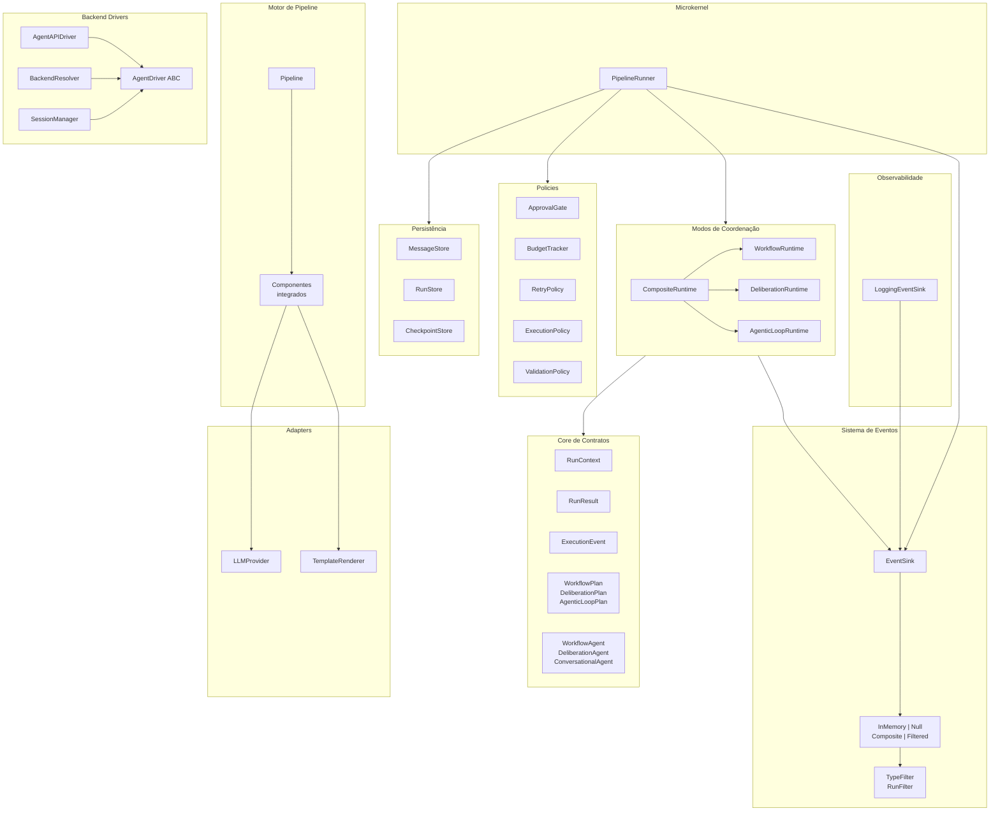

# C4 Nível 3: Componentes internos

## Visão geral

Este documento detalha os componentes implementados dentro dos containers lógicos do MiniAutoGen, conforme a arquitetura Side C. O framework segue um modelo Microkernel onde o `PipelineRunner` atua como executor central, os modos de coordenação definem estratégias de interação entre agentes, e contratos Pydantic garantem tipagem forte em todas as fronteiras.

---

## 1. Core de contratos

Módulo: `miniautogen/core/contracts/`

O núcleo de contratos define todos os modelos de dados e protocolos que governam a comunicação interna do framework. Nenhum componente externo pode interagir com o domínio sem passar por estes contratos.

Modelos principais:

| Modelo | Arquivo | Responsabilidade |
| --- | --- | --- |
| `RunContext` | `run_context.py` | Contexto tipado de execução: `run_id`, `correlation_id`, `execution_state`, `input_payload`, `timeout_seconds`. Possui `with_previous_result()` para encadear resultados entre etapas. |
| `RunResult` | `run_result.py` | Resultado terminal com `run_id`, `status` (enum `RunStatus`), `output`, `error` e `metadata`. |
| `Message` | `message.py` | Mensagem de conversação: `sender_id`, `content`, `timestamp`. |
| `Conversation` | `conversation.py` | Conversação imutável. O método `add_message()` retorna uma nova instância. |
| `ExecutionEvent` | `events.py` | Evento canônico com `type`, `timestamp`, `run_id`, `correlation_id`, `scope` e `payload`. |

Planos de coordenação:

| Plano | Campos principais |
| --- | --- |
| `WorkflowPlan` | `steps: list[WorkflowStep]`, `fan_out: bool`, `synthesis_agent: str` |
| `DeliberationPlan` | `topic`, `participants`, `max_rounds`, `leader_agent`, `policy` |
| `AgenticLoopPlan` | `router_agent`, `participants`, `policy`, `goal`, `initial_message` |

Contratos adicionais: `AgentSpec`, `SkillSpec`, `ToolSpec`, `ToolResult`, `EngineProfile`, `MemoryProfile`, `McpServerBinding`, `ConversationPolicy`, `Contribution`, `Review`, `RouterDecision`, `SubrunRequest` (experimental).

Enums: `RunStatus`, `LoopStopReason`, `CoordinationKind`.

---

## 2. Protocolos de agente

Módulo: `miniautogen/core/contracts/agent.py`

Três protocolos `runtime_checkable` definem as capacidades que um agente deve satisfazer para participar em cada modo de coordenação.

| Protocolo | Métodos | Modo de coordenação |
| --- | --- | --- |
| `WorkflowAgent` | `async process(input) -> Any` | WorkflowRuntime |
| `DeliberationAgent` | `async contribute(topic) -> Contribution`, `async review(target_id, contribution) -> Review` | DeliberationRuntime |
| `ConversationalAgent` | `async reply(message, context) -> str`, `async route(conversation_history) -> RouterDecision` | AgenticLoopRuntime |

O isolamento por protocolo garante que agentes são validados estruturalmente em tempo de execução, sem herança obrigatória.

---

## 3. Modos de coordenação

Módulo: `miniautogen/core/runtime/`

O protocolo `CoordinationMode` define a interface genérica: `async run(agents, context, plan) -> RunResult`. O enum `CoordinationKind` identifica o modo ativo: `WORKFLOW`, `DELIBERATION` ou `AGENTIC_LOOP`.

### 3.1 WorkflowRuntime

Arquivo: `workflow_runtime.py`

Execução sequencial ou paralela (fan-out) de etapas definidas em `WorkflowPlan`. Suporta agente de síntese opcional que consolida resultados após fan-out. Consulta agentes por ID num registro interno.

Eventos emitidos: `RUN_STARTED`, `COMPONENT_STARTED`, `COMPONENT_FINISHED`, `RUN_FINISHED`.

### 3.2 DeliberationRuntime

Arquivo: `deliberation_runtime.py`

Ciclo iterativo: contribuição, revisão por pares, consolidação, verificação de suficiência e iteração ou finalização. O agente líder conduz a síntese final. Inclui helpers auxiliares: `summarize_peer_reviews()`, `build_follow_up_tasks()`, `apply_leader_review()`, `render_final_document_markdown()`.

Eventos emitidos: `DELIBERATION_STARTED`, `DELIBERATION_ROUND_COMPLETED`, `DELIBERATION_FINISHED`, `DELIBERATION_FAILED`.

### 3.3 AgenticLoopRuntime

Arquivo: `agentic_loop_runtime.py`

Loop conversacional dirigido por um agente roteador. O roteador seleciona o próximo participante a cada turno. Detecção de estagnação integrada. Quatro condições de paragem: terminação explícita, estagnação, `max_turns` e limite de orçamento.

Eventos emitidos: `AGENTIC_LOOP_STARTED`, `ROUTER_DECISION`, `AGENT_REPLIED`, `AGENTIC_LOOP_STOPPED`, `STAGNATION_DETECTED`.

### 3.4 CompositeRuntime

Arquivo: `composite_runtime.py`

Compõe modos de coordenação em sequência. Cada `CompositionStep` define o modo, plano, label descritivo e mapeadores opcionais de entrada/saída. O resultado de cada etapa é injetado no contexto da etapa seguinte via `with_previous_result()`. Falha rápida: se uma etapa retornar `FAILED`, a composição é interrompida imediatamente.

---

## 4. Microkernel (PipelineRunner)

Arquivo: `miniautogen/core/runtime/pipeline_runner.py`

O `PipelineRunner` é o único executor oficial do framework. Centraliza o ciclo de vida de execução com as seguintes responsabilidades:

- Gerar `run_id` e `correlation_id` para rastreabilidade.
- Emitir eventos canônicos (`RUN_STARTED`, `RUN_FINISHED`, `RUN_FAILED`, `RUN_TIMED_OUT`).
- Aplicar timeout via `anyio.fail_after()` com base em `ExecutionPolicy` ou parâmetro explícito.
- Executar o gate de aprovação (`ApprovalGate`) quando configurado, emitindo `APPROVAL_REQUESTED`, `APPROVAL_GRANTED` ou `APPROVAL_DENIED`.
- Persistir estado de execução em `RunStore` e checkpoints em `CheckpointStore`.
- Aplicar `RetryPolicy` com backoff exponencial sobre a execução do pipeline.

Dependências injetáveis: `EventSink`, `RunStore`, `CheckpointStore`, `ExecutionPolicy`, `ApprovalGate`, `RetryPolicy`. Todas opcionais, com defaults seguros (`NullEventSink`).

---

## 5. Motor de pipeline

Módulo: `miniautogen/pipeline/`

### Pipeline

Arquivo: `pipeline.py`

Lista ordenada de `PipelineComponent`. A execução é sequencial e assíncrona: cada componente recebe o estado, processa e devolve o estado atualizado.

### DynamicChatPipeline

Arquivo: `dynamic_chat_pipeline.py`

Especialização para interação conversacional dinâmica.

### Componentes integrados

Todos em `miniautogen/pipeline/`:

| Componente | Função |
| --- | --- |
| `UserResponseComponent` | Coleta entrada do utilizador via executor assíncrono. |
| `NextAgentSelectorComponent` | Seleciona o próximo agente por rotação simples. |
| `AgentReplyComponent` | Invoca `generate_reply` do agente selecionado e persiste a resposta. |
| `TerminateChatComponent` | Interrompe execução quando o conteúdo contém `TERMINATE`. |
| `LLMResponseComponent` | Envia prompt ao cliente LLM e grava a resposta no estado. |
| `Jinja2SingleTemplateComponent` | Renderiza template Jinja2 com contexto de mensagens e variáveis. |

---

## 6. Sistema de eventos

Módulo: `miniautogen/core/events/`

O framework emite 42 tipos de evento canônico organizados em 10 categorias:

| Categoria | Eventos |
| --- | --- |
| Ciclo de vida da execução | `RUN_STARTED`, `RUN_FINISHED`, `RUN_FAILED`, `RUN_CANCELLED`, `RUN_TIMED_OUT` |
| Componente | `COMPONENT_STARTED`, `COMPONENT_FINISHED`, `COMPONENT_SKIPPED`, `COMPONENT_RETRIED` |
| Ferramenta | `TOOL_INVOKED`, `TOOL_SUCCEEDED`, `TOOL_FAILED` |
| Armazenamento | `CHECKPOINT_SAVED`, `CHECKPOINT_RESTORED` |
| Policies | `POLICY_APPLIED`, `VALIDATION_FAILED`, `BUDGET_EXCEEDED` |
| Adapter | `ADAPTER_FAILED` |
| Loop agêntico | `AGENTIC_LOOP_STARTED`, `ROUTER_DECISION`, `AGENT_REPLIED`, `AGENTIC_LOOP_STOPPED`, `STAGNATION_DETECTED` |
| Deliberação | `DELIBERATION_STARTED`, `DELIBERATION_ROUND_COMPLETED`, `DELIBERATION_FINISHED`, `DELIBERATION_FAILED` |
| Backend drivers | `BACKEND_SESSION_STARTED`, `BACKEND_TURN_STARTED`, `BACKEND_MESSAGE_DELTA`, `BACKEND_MESSAGE_COMPLETED`, `BACKEND_TOOL_CALL_REQUESTED`, `BACKEND_TOOL_CALL_EXECUTED`, `BACKEND_ARTIFACT_EMITTED`, `BACKEND_WARNING`, `BACKEND_ERROR`, `BACKEND_TURN_COMPLETED`, `BACKEND_SESSION_CLOSED` |
| Aprovação | `APPROVAL_REQUESTED`, `APPROVAL_GRANTED`, `APPROVAL_DENIED`, `APPROVAL_TIMEOUT` |

### Event sinks

| Sink | Função |
| --- | --- |
| `EventSink` | Protocolo base com `publish(event)`. |
| `InMemoryEventSink` | Armazena eventos em lista para testes e inspeção. |
| `NullEventSink` | Descarta eventos silenciosamente. Default do `PipelineRunner`. |
| `CompositeEventSink` | Propaga para múltiplos sinks em paralelo. |
| `FilteredEventSink` | Aplica `EventFilter` antes de propagar ao sink delegado. |

### Filtros de eventos

`EventFilter` (protocolo), `TypeFilter` (por tipo de evento), `RunFilter` (por `run_id`), `CompositeFilter` (conjunção de filtros).

---

## 7. Policies

Módulo: `miniautogen/policies/`

Policies operam lateralmente ao Core. O Core emite eventos e as policies observam e reagem, sem acoplar lógica de controle ao fluxo principal.

| Policy | Arquivo | Função |
| --- | --- | --- |
| `ApprovalPolicy` / `ApprovalGate` | `approval.py` | Workflow de aprovação request-response antes da execução. |
| `BudgetPolicy` / `BudgetTracker` | `budget.py` | Rastreamento e enforcement de limites de tokens e custo. |
| `ExecutionPolicy` | `execution.py` | Configuração de timeout e parâmetros de execução. |
| `RetryPolicy` | `retry.py` | Retentativas com backoff exponencial. |
| `TimeoutScope` | `timeout.py` | Gestão de timeout estruturado. |
| `ValidationPolicy` | `validation.py` | Validação de entrada e saída. |
| `PermissionPolicy` | `permission.py` | Controle de acesso baseado em permissões. |
| `PolicyChain` / `PolicyEvaluator` | `chain.py` | Composição e avaliação sequencial de múltiplas policies. |

---

## 8. Persistência

Módulo: `miniautogen/stores/`

Três tipos de store com duas implementações cada:

| Store | InMemory | SQLAlchemy |
| --- | --- | --- |
| `MessageStore` | `InMemoryMessageStore` | `SQLAlchemyMessageStore` |
| `RunStore` | `InMemoryRunStore` | `SQLAlchemyRunStore` |
| `CheckpointStore` | `InMemoryCheckpointStore` | `SQLAlchemyCheckpointStore` |

As implementações InMemory servem para testes e execuções efémeras. As implementações SQLAlchemy utilizam sessões assíncronas para persistência durável. O `StoreProtocol` em `core/contracts/store.py` define o contrato que ambas as variantes cumprem.

---

## 9. Backend drivers

Módulo: `miniautogen/backends/`

### AgentDriver (ABC)

Arquivo: `driver.py`

Interface unificada para backends externos com seis métodos abstratos: `start_session`, `send_turn` (async generator de `AgentEvent`), `cancel_turn`, `list_artifacts`, `close_session` e `capabilities`.

### AgentAPIDriver

Arquivo: `agentapi/driver.py`

Implementação HTTP bridge compatível com endpoints OpenAI. Utiliza `anyio.fail_after()` para timeouts de rede.

### BackendResolver

Arquivo: `resolver.py`

Instanciação de drivers orientada por configuração. Mantém um registro de fábricas (`DriverFactory`) por tipo de driver e cache de instâncias já criadas.

### SessionManager

Arquivo: `sessions.py`

Máquina de estados para o ciclo de vida de sessões com 7 estados: `CREATED`, `ACTIVE`, `BUSY`, `INTERRUPTED`, `COMPLETED`, `FAILED`, `CLOSED`. Transições inválidas lançam `InvalidTransitionError`.

### Modelos

Arquivo: `models.py`

`BackendCapabilities`, `StartSessionRequest`, `StartSessionResponse`, `SendTurnRequest`, `CancelTurnRequest`, `ArtifactRef`, `AgentEvent`.

---

## 10. Adapters

Módulo: `miniautogen/adapters/`

Adapters concretos nunca vazam para o domínio interno. Toda comunicação ocorre via protocolos tipados.

### LLM

Arquivos: `llm/protocol.py`, `llm/providers.py`, `llm/openai_compatible_provider.py`

| Componente | Função |
| --- | --- |
| `LLMProvider` (Protocol) | Contrato para provedores de modelos de linguagem. |
| `OpenAICompatibleProvider` | Cliente HTTP para endpoints compatíveis com a API OpenAI. |
| `LiteLLMProvider` | Integração via biblioteca LiteLLM para múltiplos provedores. |
| `OpenAIProvider` | Cliente direto para a API OpenAI. |

### Templates

Arquivos: `templates/protocol.py`, `templates/jinja_renderer.py`

| Componente | Função |
| --- | --- |
| `TemplateRenderer` (Protocol) | Contrato para renderização de templates. |
| `JinjaRenderer` | Implementação baseada em Jinja2. |

---

## 11. Observabilidade

Módulo: `miniautogen/observability/`

### LoggingEventSink

Arquivo: `event_logging.py`

Ponte entre o sistema de eventos e o structlog. Mapeia tipos de evento a níveis de log:

| Nível | Tipos de evento |
| --- | --- |
| `error` | `RUN_FAILED`, `RUN_TIMED_OUT`, `TOOL_FAILED`, `ADAPTER_FAILED`, `DELIBERATION_FAILED` |
| `warning` | `STAGNATION_DETECTED`, `BUDGET_EXCEEDED`, `VALIDATION_FAILED` |
| `info` | Todos os demais |

Módulo auxiliar `logging.py` disponibiliza `configure_logging()` e `get_logger()` para configuração global do structlog.

---

## Diagrama de componentes

