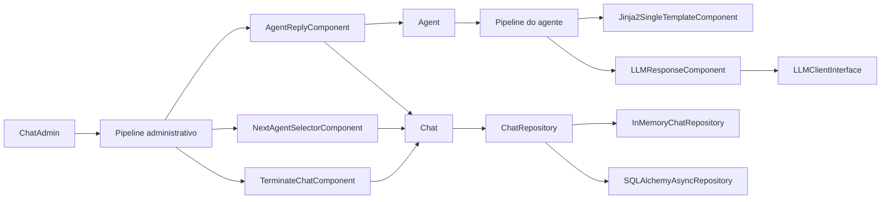

# C4 Nível 3: Componentes Internos

## Visão geral

Este nível detalha os principais componentes implementados hoje dentro dos containers lógicos do MiniAutoGen.

## 1. Core de Conversação

### `Chat`

Arquivo: `miniautogen/chat/chat.py`

Responsabilidades:

- receber mensagens por `add_message`;
- recuperar mensagens por `get_messages`;
- manter a coleção de agentes participantes;
- delegar persistência ao `ChatRepository`;
- manter `ChatState` local com contexto e histórico.

Entradas principais:

- `sender_id`, `content` e `additional_info` ao adicionar mensagens;
- `repository` opcional no construtor.

Saídas principais:

- instâncias de `Message`;
- listas de mensagens consultadas do repositório.

Dependências:

- `ChatRepository`;
- `InMemoryChatRepository` como padrão;
- `Agent`;
- `Message` e `ChatState`.

### `Message`, `AgentConfig` e `ChatState`

Arquivo: `miniautogen/schemas.py`

Responsabilidades:

- definir contratos de dados da solução com Pydantic;
- padronizar o formato das mensagens;
- representar estado contextual do chat.

## 2. Orquestração

### `ChatAdmin`

Arquivo: `miniautogen/chat/chatadmin.py`

Responsabilidades:

- controlar o ciclo de rodadas;
- instanciar o `ChatPipelineState` da execução;
- invocar o pipeline administrativo;
- interromper a execução por parada explícita ou por limite de rodadas.

Estado relevante:

- `group_chat`;
- `goal`;
- `round`;
- `max_rounds`;
- `running`.

Pipeline típico:

- `NextAgentSelectorComponent`
- `AgentReplyComponent`
- `TerminateChatComponent`

## 3. Runtime de Agentes

### `Agent`

Arquivo: `miniautogen/agent/agent.py`

Responsabilidades:

- representar identidade, nome e papel do agente;
- manter referência ao pipeline responsável por gerar sua resposta;
- expor `generate_reply`, que executa o pipeline do agente.

Comportamento atual de `generate_reply`:

- executa `self.pipeline.run(state)` quando houver pipeline;
- espera que o estado final contenha a chave `reply`;
- retorna uma mensagem de fallback se a chave não existir;
- retorna uma mensagem padrão quando o agente não possui pipeline.

## 4. Motor de Pipeline

### `Pipeline`

Arquivo: `miniautogen/pipeline/pipeline.py`

Responsabilidades:

- manter uma lista ordenada de componentes;
- validar o tipo de novos componentes em `add_component`;
- executar `process` de cada componente de forma sequencial e assíncrona.

### `PipelineState` e `ChatPipelineState`

Arquivo: `miniautogen/pipeline/pipeline.py`

Responsabilidades:

- definir contrato para leitura e atualização de estado;
- permitir que os componentes compartilhem informações por chaves dinâmicas.

### `PipelineComponent`

Arquivo: `miniautogen/pipeline/components/pipelinecomponent.py`

Responsabilidades:

- definir a interface assíncrona mínima de um componente de pipeline.

### Componentes prontos

Arquivo: `miniautogen/pipeline/components/components.py`

#### `UserResponseComponent`

- coleta uma resposta via `input()` em executor assíncrono;
- grava `reply` no estado.

#### `NextAgentSelectorComponent`

- lê o último remetente do histórico;
- escolhe o próximo agente em rotação simples;
- grava `selected_agent` no estado.

#### `AgentReplyComponent`

- obtém `selected_agent` e `group_chat` do estado;
- chama `agent.generate_reply(state)`;
- persiste a resposta no chat.

#### `TerminateChatComponent`

- lê a última mensagem;
- interrompe o `ChatAdmin` quando o conteúdo contém `TERMINATE`.

#### `LLMResponseComponent`

- lê `prompt` do estado;
- usa um cliente LLM assíncrono para gerar resposta;
- grava `reply` no estado.

#### `Jinja2SingleTemplateComponent`

- consulta mensagens recentes do chat;
- monta um contexto com `chat`, `agent`, `messages` e variáveis extras;
- renderiza um template Jinja2;
- converte a saída para JSON quando possível;
- grava `prompt` no estado.

## 5. Persistência

### `ChatRepository`

Arquivo: `miniautogen/storage/repository.py`

Responsabilidades:

- definir o contrato assíncrono para persistência de mensagens;
- padronizar operações de inclusão, consulta e remoção.

### `InMemoryChatRepository`

Arquivo: `miniautogen/storage/in_memory_repository.py`

Responsabilidades:

- armazenar mensagens em lista local;
- atribuir identificadores incrementais;
- servir como implementação simples para testes e demos.

### `SQLAlchemyAsyncRepository`

Arquivo: `miniautogen/storage/sql_repository.py`

Responsabilidades:

- persistir mensagens com SQLAlchemy async;
- criar a tabela `messages` via `init_db`;
- converter objetos ORM em `Message`.

Modelo persistido:

- `id`
- `sender_id`
- `message`
- `timestamp`
- `additional_info`

## 6. Gateway de LLM

### `LLMClientInterface`

Arquivo: `miniautogen/llms/llm_client.py`

> **Nota:** O `LLMClientInterface` é a interface legada. A nova arquitetura usa `LLMProviderProtocol` (em `miniautogen/adapters/llm/protocol.py`) e o `AgentAPIDriver` (em `miniautogen/backends/agentapi/`) para integração com LLMs externos.

Responsabilidades:

- definir contrato comum para clientes de modelo.

### `OpenAIClient`

- usa `openai.AsyncOpenAI`;
- chama `chat.completions.create`;
- retorna o conteúdo textual da primeira escolha.

### `LiteLLMClient`

- usa `litellm.acompletion`;
- seleciona `default_model` quando nenhum modelo é informado;
- retorna o conteúdo textual da primeira escolha.

## Diagrama de componentes

