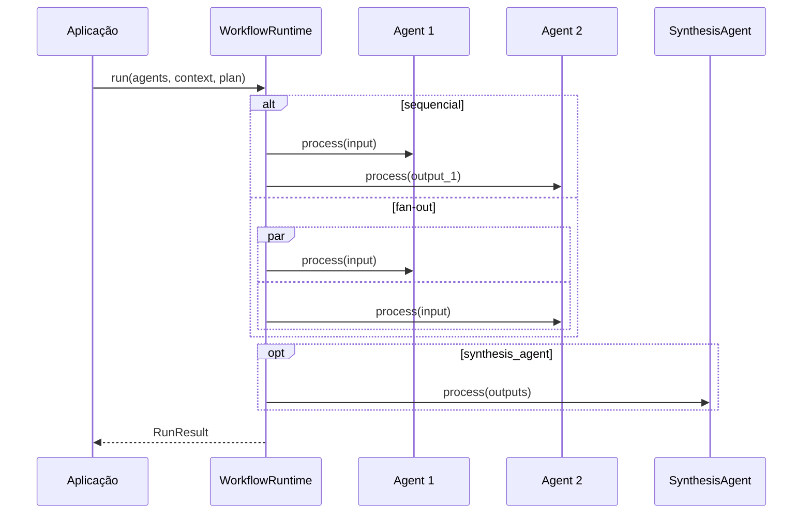
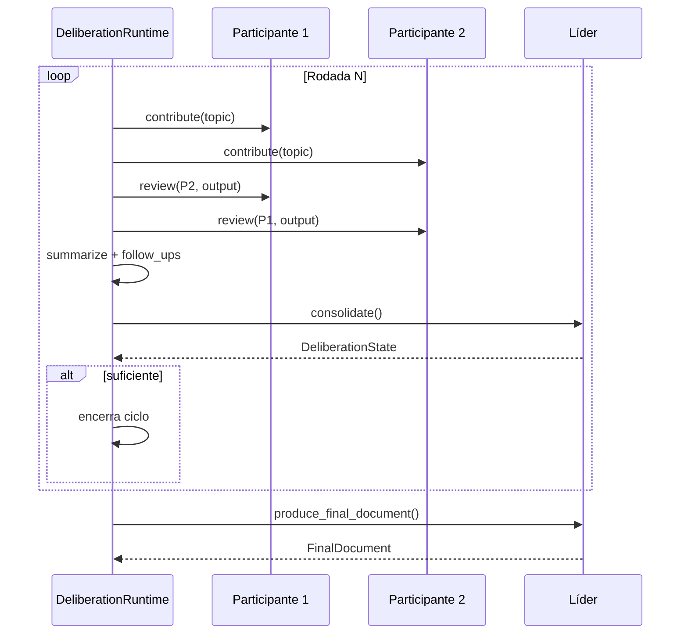
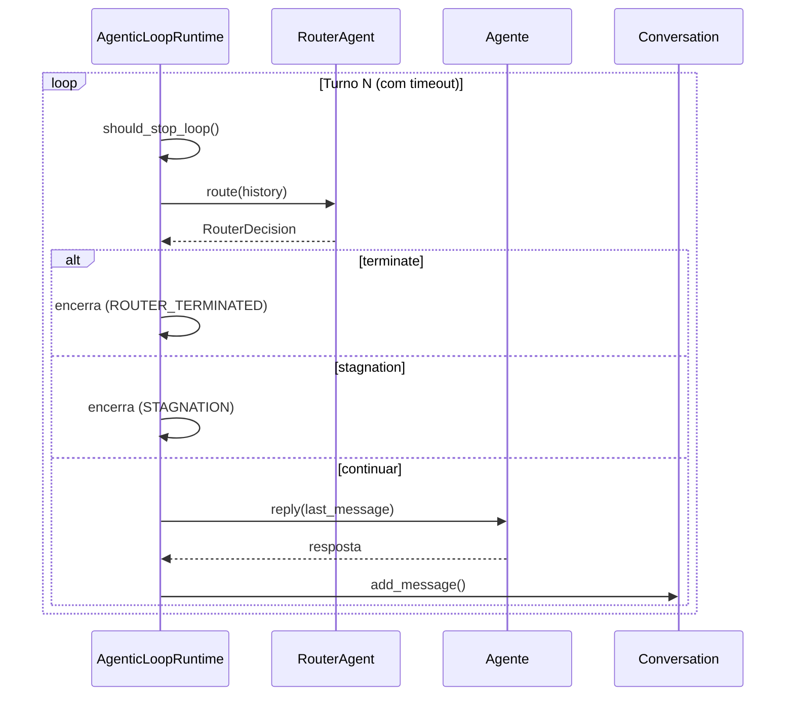
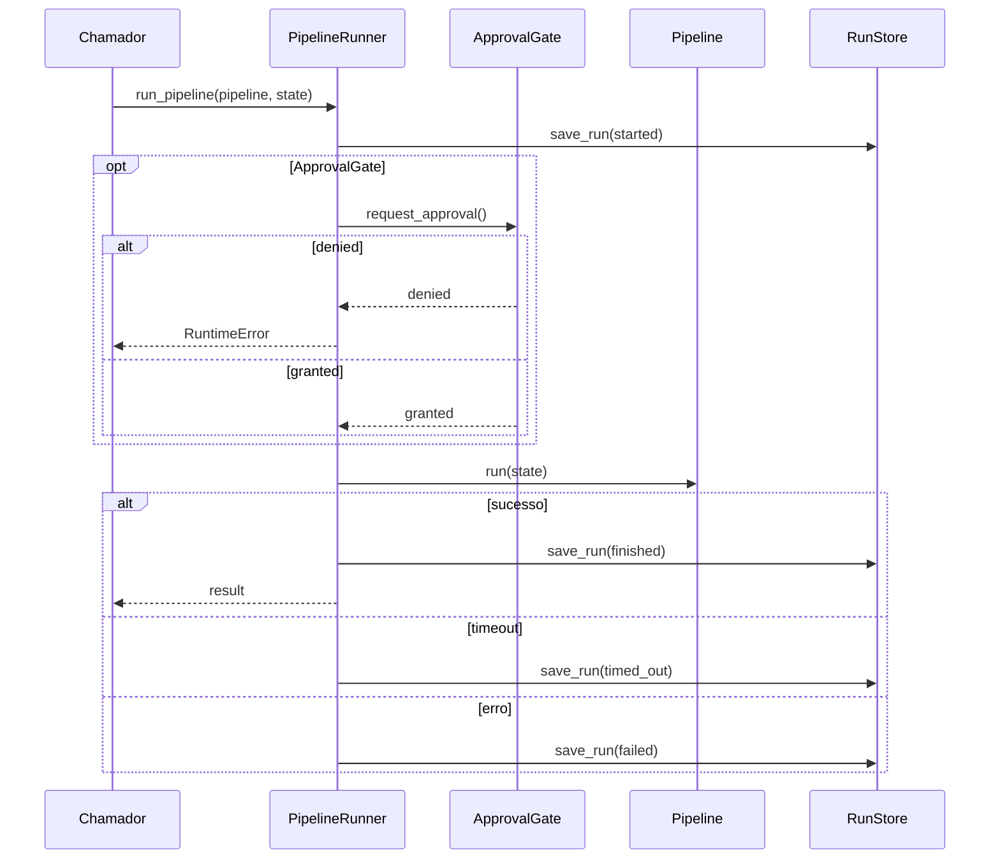

# Fluxos de execução

Cada fluxo abaixo mapeia diretamente para código em `core/runtime/` e `cli/`.

---

## Fluxo 1: execução de workflow

O `WorkflowRuntime` executa um `WorkflowPlan` de forma sequencial ou paralela.

1. Valida que todos os `agent_id` do plano existem no registro.
2. Emite `run_started`.
3. Se `fan_out=False`, executa passos em sequência -- a saída de cada passo alimenta o próximo.
4. Se `fan_out=True`, executa todos os passos em paralelo via `anyio.create_task_group()`, cada um recebendo o mesmo `input_payload`.
5. Se `synthesis_agent` está definido, invoca-o com a lista de saídas coletadas.
6. Emite `run_finished` ou `run_failed`.



---

## Fluxo 2: deliberação multiagente

O `DeliberationRuntime` implementa um ciclo de múltiplas rodadas com revisão cruzada e consolidação por líder.

1. Valida participantes e líder. Se `leader_agent` não está definido, o primeiro participante assume.
2. Emite `deliberation_started`.
3. Para cada rodada (até `max_rounds`):
   - **Contribuição:** cada participante produz `ResearchOutput` via `contribute(topic)`.
   - **Revisão cruzada:** cada participante revisa os demais via `review(target_id, contribution)`, gerando `PeerReview`. Helpers `summarize_peer_reviews()` e `build_follow_up_tasks()` agregam resultados.
   - **Consolidação:** o líder invoca `consolidate()` e produz `DeliberationState` com fatos aceitos, conflitos, gaps e decisão de suficiência.
   - **Suficiência:** se `is_sufficient == True`, encerra. Senão, frentes rejeitadas voltam para a próxima rodada.
4. O líder produz `FinalDocument` via `produce_final_document()`, renderizado por `render_final_document_markdown()`.
5. Emite `deliberation_finished`.



---

## Fluxo 3: agentic loop com contenção

O `AgenticLoopRuntime` implementa um loop conversacional dirigido por roteador com mecanismos de contenção.

1. Valida `router_agent` e `participants` no registro.
2. Emite `agentic_loop_started`. Inicializa `Conversation` com `initial_message` opcional.
3. Para cada turno (até `max_turns`, dentro de `fail_after(timeout_seconds)`):
   - `should_stop_loop(state, policy)` avalia condições de parada antecipada.
   - Router invoca `route(history)` e retorna `RouterDecision` com `next_agent` e `terminate`.
   - Emite `router_decision`. Se `terminate == True`, encerra.
   - `detect_stagnation()` verifica padrões repetitivos. Se detectado, emite `stagnation_detected` e encerra.
   - Agente selecionado invoca `reply(last_message, context)`. Mensagem adicionada a `Conversation`.
   - Emite `agent_replied`. Atualiza `AgenticLoopState`.
4. Emite `agentic_loop_stopped` com razão (`ROUTER_TERMINATED`, `STAGNATION`, `MAX_TURNS`, `TIMEOUT`) e número de turnos.



---

## Fluxo 4: composição de modos

O `CompositeRuntime` encadeia modos de coordenação em sequência, permitindo combinações como workflow, depois deliberação, depois workflow.

1. Para cada `CompositionStep`:
   - Aplica `input_mapper(result, context)` se definido, ou `RunContext.with_previous_result()` para injetar a saída anterior como `input_payload`.
   - Executa `step.mode.run(agents, context, plan)`.
   - Aplica `output_mapper(result)` se definido.
   - Se status é `FAILED`, interrompe imediatamente (fail-fast).
2. Retorna o `RunResult` do último passo.

---

## Fluxo 5: execução pelo microkernel

O `PipelineRunner` é o executor central. Todos os modos delegam emissão de eventos e persistência a ele.

1. Gera `run_id` e `correlation_id`. Persiste no `RunStore` com status `started`. Emite `run_started`.
2. **Gate de aprovação (opcional):** emite `approval_requested`, aguarda decisão. Se `denied`, emite `approval_denied`, persiste `cancelled` e lança `RuntimeError`. Se aprovado, emite `approval_granted`.
3. **Execução:** envolve com `RetryPolicy` se configurada. Aplica `anyio.fail_after()` se timeout definido. Executa `pipeline.run(state)`.
4. **Erros:** `TimeoutError` persiste `timed_out` e emite `run_timed_out`. Outras exceções persistem `failed` e emitem `run_failed`. Ambos relançam a exceção.
5. **Sucesso:** persiste `finished`, salva checkpoint no `CheckpointStore` e emite `run_finished`.



---

## Fluxo 6: operações CLI

A CLI oferece quatro comandos que cobrem o ciclo de vida de um projeto.

- **init** -- Gera a estrutura inicial com `miniautogen.yml` e diretório de templates. Aceita `--example`.
- **check** -- Valida configuração: existência do YAML, resolução de agentes, integridade dos pipelines.
- **run** -- Executa um pipeline nomeado de forma headless, delegando ao `PipelineRunner`.
- **sessions** -- `list` exibe execuções com filtros. `clean` remove execuções antigas por idade.

```
init [--example] -> check -> run <pipeline> -> sessions list|clean
```

---

## Pontos de extensão

- **Novos modos de coordenação.** Implemente o protocolo `CoordinationMode` (`async def run(agents, context, plan) -> RunResult`).
- **Novos tipos de agente.** Implemente os protocolos do modo alvo: `process()` para workflows, `contribute()`/`review()`/`consolidate()` para deliberação, `route()`/`reply()` para agentic loop.
- **Novos backends de persistência.** Implemente `RunStore` ou `CheckpointStore`.
- **Novos backend drivers.** Estenda o ABC `AgentDriver` para novos provedores.
- **Novas policies.** Implemente `ExecutionPolicy`, `RetryPolicy` ou `ApprovalGate`.
