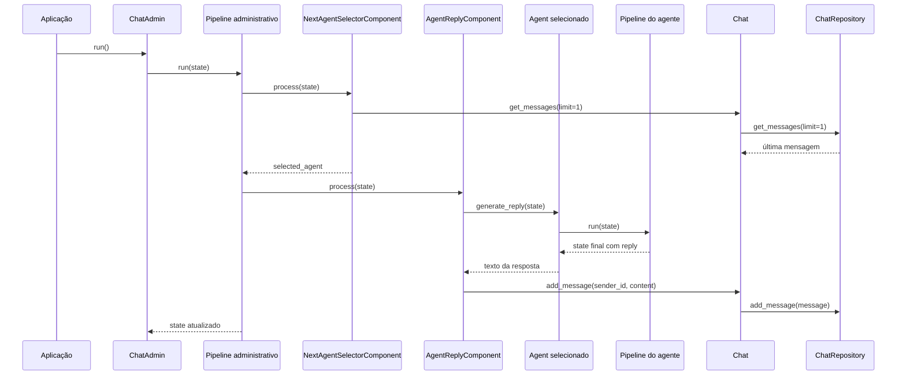

# Fluxos de Execução

## Visão geral

Os fluxos abaixo descrevem como os principais módulos colaboram no estado atual da solução.

## Fluxo 1: inicialização de uma conversa

1. A aplicação hospedeira instancia um `Chat`, opcionalmente informando um `ChatRepository`.
2. A aplicação cria um ou mais `Agent` e associa pipelines quando necessário.
3. Os agentes são registrados no `Chat` por `add_agent`.
4. A aplicação define um pipeline administrativo e instancia um `ChatAdmin`.
5. Mensagens iniciais podem ser semeadas no chat antes da execução.

## Fluxo 2: execução de uma rodada do chat

## Fluxo 3: construção de prompt para LLM

1. Um componente anterior ou o próprio pipeline prepara o contexto base.
2. `Jinja2SingleTemplateComponent` consulta mensagens recentes do `Chat`.
3. O componente converte as mensagens para uma estrutura simples com `sender_id`, `message` e `timestamp`.
4. O template é renderizado com `chat`, `agent`, `messages` e `variables`.
5. O resultado é salvo em `prompt` no estado.
6. `LLMResponseComponent` consome `prompt` e solicita resposta ao cliente LLM configurado.
7. A resposta gerada é gravada em `reply`.

## Fluxo 4: persistência de mensagens

### Repositório em memória

1. `Chat.add_message` cria um objeto `Message`.
2. O objeto é enviado para `InMemoryChatRepository.add_message`.
3. O repositório atribui um `id` incremental quando necessário.
4. A mensagem é armazenada na lista interna e também anexada a `context.messages`.

### Repositório SQL assíncrono

1. `Chat.add_message` cria um objeto `Message`.
2. O objeto é enviado para `SQLAlchemyAsyncRepository.add_message`.
3. A mensagem é convertida em `DBMessage`.
4. O registro é persistido na tabela `messages`.
5. Consultas posteriores retornam objetos `Message` reconstruídos a partir do banco.

## Fluxo 5: encerramento da conversa

O encerramento hoje depende de duas condições:

- `ChatAdmin` atingir `max_rounds`;
- `TerminateChatComponent` encontrar a palavra `TERMINATE` na última mensagem e chamar `chat_admin.stop()`.

## Fluxo 6: pesquisa deliberativa multiagente

O fluxo deliberativo adiciona uma camada de colaboração estruturada sobre o runtime oficial.

1. O `Lead Researcher` produz o plano inicial da investigação.
2. Especialistas executam a primeira rodada e retornam `ResearchOutput` com:
   - fatos
   - evidências
   - inferências
   - incertezas
   - próximos testes
3. Cada especialista revisa a saída de outro especialista via `PeerReview`.
4. O runtime agrega essas revisões com `summarize_peer_reviews` e gera follow-ups com `build_follow_up_tasks`.
5. O líder consolida:
   - fatos aceitos
   - conflitos abertos
   - gaps pendentes
   - suficiência da rodada
   - razões de rejeição
6. Só as frentes reprovadas ou incompletas voltam para a rodada seguinte.
7. O `Documentation Agent` gera um `FinalDocument` orientado a decisão.
8. O documento final é renderizado por `render_final_document_markdown`.

Esse desenho melhora três coisas ao mesmo tempo:
- qualidade do raciocínio, porque obriga separação entre fato e inferência;
- colaboração, porque inclui revisão cruzada antes da decisão do líder;
- qualidade do artefato final, porque o documento passa a carregar trilha decisória explícita.

## Fluxo 7: agentic loop com contenção sistêmica

O modo agentic reintroduz conversa livre como capability controlada do runtime.

1. Um roteador emite `RouterDecision` com:
   - resumo do estado atual;
   - informação faltante;
   - próximo agente;
   - sinal de término;
   - risco de estagnação.
2. O agente selecionado produz sua resposta.
3. A mensagem é persistida no `MessageStore`.
4. `ConversationPolicy` avalia:
   - `max_turns`
   - `timeout_seconds`
   - `budget_cap`
   - estagnação
5. O loop continua ou termina de forma controlada.

Esse modo não substitui o runtime novo. Ele roda dentro dele.

## Pontos de extensão

O desenho atual favorece extensão em três locais principais:

- novos componentes de pipeline, implementando `PipelineComponent`;
- novas implementações de `ChatRepository`;
- novos clientes aderentes ao contrato `LLMClientInterface`.
