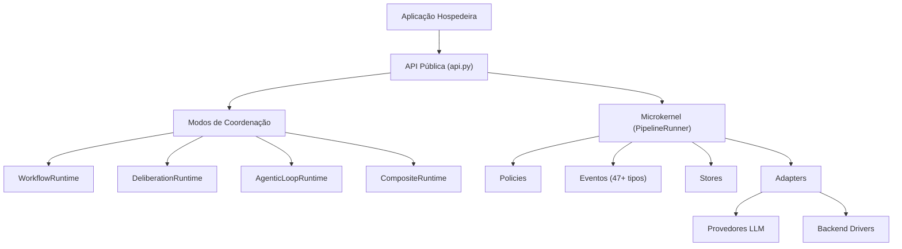

# Arquitetura do MiniAutoGen

## Posicionamento

MiniAutoGen é um microkernel Python para coordenação multi-agente que oferece quatro modos de coordenação nativos -- workflow, deliberation, agentic loop e composite -- composíveis via composite runtime. O kernel centraliza a gestão de contexto de execução (RunContext), emissão de eventos (47+ tipos em 12 categorias), enforcement de políticas transversais e propagação de resultados (RunResult). Toda concorrência é estruturada via AnyIO, garantindo cancelamento determinístico e isolamento de falhas.

---

## Camadas da arquitetura

| Camada | Nome | Descrição |
|--------|------|-----------|
| 4 | API Pública | `miniautogen/api.py` -- ponto de entrada único, exporta 54 tipos |
| 3 | Padrões Canônicos | Reservada para padrões de composição reutilizáveis (não implementada) |
| 2 | Modos de Coordenação | WorkflowRuntime, DeliberationRuntime, AgenticLoopRuntime, CompositeRuntime -- implementam o protocolo CoordinationMode |
| 1 | Kernel | PipelineRunner, RunContext, RunResult, stores, eventos, políticas, adapters |

A comunicação entre camadas é estritamente descendente: a camada superior depende da inferior, nunca o inverso. A Camada 3 está reservada e não contém implementação no estado atual do código.

---

## Conceitos de primeira classe

A evolução arquitetural do MiniAutoGen consolida quatro conceitos de primeira classe que estruturam toda a experiência do framework:

| Conceito | Descrição |
|----------|-----------|
| **Workspace** | Unidade organizacional de topo. Substitui o antigo "Project". Contém configuração, agentes, flows e estado de sessão. |
| **Engine** | Abstração unificada do provedor de inteligência (API, CLI agent, gateway). Substitui o antigo "EngineProfile". |
| **Agent** | Entidade com identidade, engine, runtime local, policies e protocol adapters. A anatomia completa é descrita em [`07-agent-anatomy.md`](07-agent-anatomy.md). |
| **Flow** | Sequência coordenada de interações entre agentes. Substitui o antigo "Pipeline" na terminologia do utilizador. |

A estratégia multi-provider é central ao design: **"O agente é commodity. O runtime é o produto."** O MiniAutoGen trata engines (Claude, GPT, Gemini, Codex CLI, etc.) como recursos intercambiáveis, focando o valor diferencial na camada de runtime -- coordenação, policies, observabilidade e interceptors. Para contexto competitivo, consulte [`../../competitive-landscape.md`](../../competitive-landscape.md).

---

## Mapa de módulos

| Diretório | Responsabilidade |
|-----------|------------------|
| `core/contracts/` | Modelos Pydantic (30+) e definições de Protocol (WorkflowAgent, DeliberationAgent, ConversationalAgent) |
| `core/runtime/` | Implementações dos 4 modos de coordenação e PipelineRunner |
| `core/events/` | Constantes de tipos de evento e infraestrutura de event sinks |
| `pipeline/` | Abstrações Pipeline e PipelineComponent |
| `policies/` | 8 políticas transversais: budget, approval, retry, timeout, validation, permission, execution, chain |
| `adapters/` | Integração com provedores LLM (OpenAICompatibleProvider, LiteLLMProvider, OpenAIProvider) e templates Jinja2 |
| `stores/` | Camada de persistência: MessageStore, RunStore, CheckpointStore com backends InMemory e SQLAlchemy |
| `backends/` | Abstração unificada de drivers para agentes externos (AgentDriver ABC, AgentAPIDriver) |
| `observability/` | Infraestrutura de logging e LoggingEventSink |
| `cli/` | Interface de linha de comando: init, check, run, sessions (list/clean) |
| `chat/`, `agent/`, `compat/` | Módulos legados mantidos para compatibilidade retroativa |

---

## Diagrama de dependências

---

## Leitura recomendada

1. [Contexto do sistema](01-contexto.md) -- fronteiras externas e atores que interagem com o MiniAutoGen
2. [Camadas e containers](02-containers.md) -- decomposição lógica detalhada de cada camada
3. [Componentes internos](03-componentes.md) -- contratos, protocolos e classes de cada módulo
4. [Fluxos de execução](04-fluxos.md) -- sequências de execução para cada modo de coordenação
5. [Invariantes e taxonomias](05-invariantes.md) -- regras arquiteturais invioláveis e taxonomia canônica de erros
6. [Decisões arquiteturais](06-decisoes.md) -- ADRs com contexto, decisão e consequências
7. [Anatomia do agente](07-agent-anatomy.md) -- as 5 camadas do Agent Runtime: Identity, Engine, Runtime, Policies, Protocol Adapters
8. [Stack tecnológica](08-tech-stack.md) -- dependências, justificativas técnicas, diagrama de dependências
9. [Invariantes do Sistema Operacional](09-invariantes-sistema-operacional.md) -- 6 invariantes invioláveis (imutabilidade, supervisão, checkpoint, idempotência, event sourcing, tipagem)

---

## Escopo desta trilha

Esta trilha descreve:

- a biblioteca Python `miniautogen` como produto principal;
- a arquitetura microkernel com modos de coordenação composíveis;
- o mecanismo de eventos, políticas e persistência;
- a abstração de backend drivers para agentes externos;
- a integração com provedores de LLM via adapters tipados.

Esta trilha não cobre:

- documentação de contribuição ou versionamento;
- detalhamento da CLI ou guias de uso (consulte [guides/](../guides/)).
