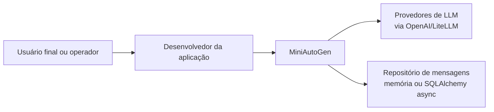

# Arquitetura do MiniAutoGen

Esta seção consolida a documentação arquitetural do MiniAutoGen usando a metodologia C4, com foco no estado atual do código.

## Objetivo

Descrever como a biblioteca está organizada hoje, quais são seus principais blocos internos, como eles colaboram entre si e quais integrações externas participam do ciclo de execução.

## Leitura recomendada

1. [Nível 1: Contexto do sistema](01-contexto.md)
2. [Nível 2: Containers lógicos](02-containers.md)
3. [Nível 3: Componentes internos](03-componentes.md)
4. [Fluxos de execução](04-fluxos.md)

## Escopo desta documentação

Esta trilha descreve:

- a biblioteca Python `miniautogen` como produto principal;
- a arquitetura assíncrona de conversação;
- o mecanismo de composição por pipelines;
- a abstração de persistência via repositórios;
- a integração com provedores de LLM por clientes assíncronos.

Esta trilha não cobre:

- análise crítica da arquitetura;
- roadmap de evolução;
- documentação detalhada de contribuição ou versionamento.

Para decisões tecnológicas, arquitetura alvo e roadmap, consulte a trilha separada em [../target-architecture/README.md](../target-architecture/README.md).

## Convenções

- O termo "container" é usado no sentido do C4 para representar blocos executáveis ou agrupamentos lógicos relevantes dentro da solução.
- Como o MiniAutoGen é uma biblioteca, os containers aqui são lógicos, não processos distribuídos independentes.
- Os nomes dos módulos e classes seguem exatamente a implementação atual.

## Visão rápida

