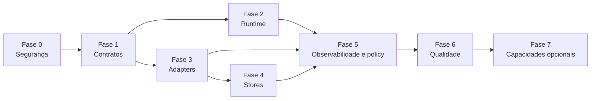

# Roadmap de Adoção

## Objetivo

Definir uma ordem pragmática de adoção da arquitetura alvo a partir do estado atual do projeto.

## Princípio do roadmap

A sequência abaixo prioriza primeiro o que reduz risco estrutural e custo futuro de mudança. O roadmap não foi organizado por “bibliotecas mais interessantes”, e sim por dependências arquiteturais.

## Fase 0. Segurança de engenharia

### Objetivos

- reduzir risco de regressão antes da refatoração estrutural;
- criar baseline confiável de comportamento atual;
- tornar mudanças arquiteturais observáveis no CI.

### Entregas sugeridas

- consolidar `pytest` como baseline;
- garantir execução consistente dos testes atuais em CI;
- introduzir `Ruff` como lint e formatter;
- definir cobertura mínima e smoke tests dos fluxos existentes;
- criar golden tests para o comportamento atual de `Chat`, `Agent`, `ChatAdmin` e pipelines;
- iniciar typing básico em superfícies centrais.

### Tecnologias-chave

- `pytest`
- `coverage.py`
- `Ruff`

### Motivo da prioridade

Mexer em contratos, runtime e stores sem baseline de engenharia aumenta demais o risco de regressão silenciosa.

### Critério de aceite

- pipeline atual coberto por smoke tests e golden tests básicos;
- lint automatizado ativo no CI;
- baseline mínima de cobertura definida e publicada;
- regressões do comportamento atual passam a ser detectáveis antes de grandes refactors.

## Fase 1. Endurecimento de contratos

### Objetivos

- ampliar o uso de modelos explícitos;
- reduzir fronteiras baseadas em estruturas informais;
- tornar o vocabulário do framework mais estável.

### Entregas sugeridas

- revisar contratos públicos existentes;
- introduzir modelos para resultados de execução;
- introduzir eventos de domínio;
- formalizar contratos de provider, store e tool;
- definir invariantes canônicos por modelo;
- separar entidades, envelopes e DTOs de borda.

### Tecnologias-chave

- `Pydantic v2`

### Motivo da prioridade

Sem contratos estáveis, toda refatoração posterior de runtime, stores ou observabilidade terá acoplamento excessivo.

### Critério de aceite

- `RunContext`, `RunResult` e `ExecutionEvent` definidos com schema e testes;
- protocolos de provider, store e tool documentados;
- invariantes mínimas registradas na trilha normativa;
- diferenciação entre entidade, envelope e DTO adotada nos contratos novos.

## Fase 2. Runtime estruturado

### Objetivos

- centralizar execução assíncrona;
- definir timeouts e cancelamento previsíveis;
- criar um `PipelineRunner` disciplinado.

### Entregas sugeridas

- introduzir AnyIO no runtime;
- criar `PipelineRunner` sem remover imediatamente o fluxo atual;
- modelar cancel scopes por execução;
- modelar timeouts por component e por adapter;
- separar orquestração da mecânica de execução;
- manter compatibilidade transitória onde o host app ainda depende do comportamento atual.

### Tecnologias-chave

- `AnyIO`

### Motivo da prioridade

É a principal evolução de robustez operacional do framework.

### Restrições de adoção

- não expor AnyIO cedo demais na superfície pública;
- não reescrever todo o runtime de uma vez;
- introduzir o novo runner ao lado das abstrações atuais antes do corte definitivo.

### Critério de aceite

- `PipelineRunner` executa o pipeline atual com compatibilidade transitória comprovada;
- timeout e cancelamento possuem semântica documentada;
- `ChatAdmin` já consegue delegar internamente ao runner novo sem romper a API inicial;
- testes de regressão do fluxo atual continuam verdes.

## Fase 3. Bordas de integração

### Objetivos

- formalizar adapters;
- impedir vazamento de semântica de fornecedor para o domínio.

### Entregas sugeridas

- consolidar `HTTPX` como base HTTP;
- definir `LLMProviderProtocol`;
- encapsular `LiteLLM` como adapter oficial;
- isolar engine de template atrás de interface.

### Tecnologias-chave

- `HTTPX`
- `LiteLLM`
- `Jinja`

### Critério de aceite

- adapters não vazam payloads ou exceções de vendor para o core;
- `LLMProviderProtocol` e `TemplateRenderer` possuem implementação de referência;
- integrações HTTP do framework usam cliente compartilhável e política de timeout explícita.

## Fase 4. Stores duráveis

### Objetivos

- ir além do armazenamento em memória ou SQL inicial;
- separar stores por responsabilidade;
- tornar persistência uma capacidade de primeira classe.

### Entregas sugeridas

- definir `StoreProtocol`;
- separar `MessageStore`, `RunStore` e `CheckpointStore`;
- definir modelo conceitual de persistência antes da implementação final;
- amadurecer SQLite local;
- preparar Postgres corporativo com Psycopg 3.

### Tecnologias-chave

- `SQLAlchemy 2.x`
- `Psycopg 3`

### Critério de aceite

- modelo conceitual de persistência foi traduzido em contratos concretos de store;
- ordering e consistência mínima de writes estão documentados;
- `MessageStore` e `RunStore` possuem implementação de referência;
- compatibilidade com o repositório legado está explícita.

## Fase 5. Observabilidade e policy layer

### Objetivos

- tornar o sistema operável e analisável;
- evitar lógica de retry espalhada;
- permitir rastreabilidade por execução.

### Entregas sugeridas

- introduzir eventos de domínio;
- consolidar taxonomia canônica de erros;
- mapear eventos para tracing e métricas;
- adotar logging estruturado;
- adicionar retry lateral a adapters críticos;
- delimitar categorias formais de policy.

### Tecnologias-chave

- `OpenTelemetry`
- `structlog`
- `Tenacity`

### Critério de aceite

- taxonomia canônica de erros e eventos adotada pelo runtime;
- logging estruturado com correlação por run está ativo;
- policies possuem categorias formais e pontos de aplicação definidos;
- retry não está embutido nas entidades centrais.

## Fase 6. Endurecimento avançado de engenharia

### Objetivos

- elevar confiança em refatorações contínuas;
- consolidar toolchain de engenharia;
- expandir validação automatizada além da baseline inicial.

### Entregas sugeridas

- expandir testes assíncronos;
- introduzir property-based tests;
- expandir typing estático;
- avaliar migração de workflow para `uv`.

### Tecnologias-chave

- `pytest`
- `pytest-asyncio`
- `Hypothesis`
- `coverage.py`
- `Ruff`
- `uv`

### Critério de aceite

- property-based tests cobrem invariantes relevantes;
- typing estático cobre superfícies centrais do core;
- a equipe possui decisão operacional registrada sobre `MyPy` e eventual avaliação de `ty`;
- migração para `uv`, se adotada, não regrediu o workflow do time.

## Fase 7. Capacidades opcionais

### Objetivos

- expandir a utilidade do framework sem deformar o core.

### Entregas sugeridas

- plugin de structured outputs;
- avaliar MCP apenas após estabilização do vocabulário interno;
- otimização de serialização em hot paths;
- melhorias de DX local.

### Tecnologias-chave

- `Instructor`
- `MCP Python SDK`
- `msgspec`
- `Rich`
- `ty`

### Critério de aceite

- nenhuma capacidade opcional invade o kernel mínimo;
- benchmarks justificam otimizações de hot path;
- integrações tardias não introduzem semântica nova no domínio antes da hora.

## Mapa de dependências entre fases

## Ganhos esperados por fase

| Fase | Ganho principal |
| --- | --- |
| 0 | Segurança para refatorar sem regressão cega |
| 1 | Clareza do vocabulário e estabilidade do core |
| 2 | Robustez de execução |
| 3 | Fronteiras limpas e menor acoplamento externo |
| 4 | Persistência pronta para cenários reais |
| 5 | Operabilidade e políticas consistentes |
| 6 | Endurecimento avançado de qualidade e manutenção |
| 7 | Expansão de capacidades sem perda de disciplina |

## Critério de sucesso do roadmap

O roadmap será bem-sucedido se o projeto evoluir sem perder:

- simplicidade da superfície pública;
- capacidade de composição;
- neutralidade do core em relação a fornecedores;
- legibilidade arquitetural para times de engenharia;
- compatibilidade transitória controlada durante a migração.
