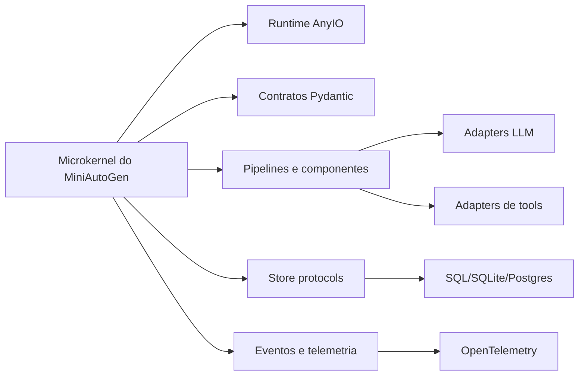

# Arquitetura Alvo do MiniAutoGen

Esta seção documenta a arquitetura alvo do MiniAutoGen e consolida uma base de conhecimento para decisões técnicas futuras.

Ao contrário da trilha em `docs/pt/architecture/`, que descreve o estado atual do código, esta trilha define:

- princípios arquiteturais desejados;
- stack tecnológico recomendado por camada;
- desenho alvo da solução;
- sequência de adoção incremental;
- critérios modernos de engenharia para orientar evolução do projeto.

## Como usar esta trilha

Esta documentação deve ser lida como material de validação e decisão de engenharia.

Uso recomendado:

1. entender os princípios em [01-principios.md](01-principios.md);
2. revisar a matriz tecnológica em [02-matriz-tecnologica.md](02-matriz-tecnologica.md);
3. comparar com a arquitetura alvo em [03-arquitetura-alvo.md](03-arquitetura-alvo.md);
4. avaliar a ordem prática de adoção em [04-roadmap-adocao.md](04-roadmap-adocao.md);
5. revisar o modelo conceitual de persistência em [05-modelo-persistencia.md](05-modelo-persistencia.md);
6. usar [06-invariantes-e-taxonomias.md](06-invariantes-e-taxonomias.md) como referência normativa;
7. validar a migração segura em [07-plano-de-migracao.md](07-plano-de-migracao.md);
8. consultar o mapa físico alvo em [08-mapa-modulos.md](08-mapa-modulos.md);
9. consultar a governança de compatibilidade em [09-governanca-compatibilidade.md](09-governanca-compatibilidade.md);
10. usar [10-base-de-conhecimento.md](10-base-de-conhecimento.md) como referência contínua.

Ela foi organizada para responder quatro perguntas diferentes:

- como o sistema deve ser desenhado;
- qual stack adotar e por quê;
- como migrar o código real sem quebrar compatibilidade cedo demais;
- quais invariantes e taxonomias precisam existir antes da implementação.

## Relação com a arquitetura atual

- [Arquitetura atual](../architecture/README.md): descreve como o projeto funciona hoje.
- Arquitetura alvo: descreve como o projeto deve evoluir para uma base mais robusta, coerente e corporativa, preservando a filosofia minimalista do framework.

## Princípio organizador

A evolução recomendada não é “adotar o maior número possível de bibliotecas modernas”. O objetivo é compor uma espinha dorsal pequena, coesa e com responsabilidades nítidas.

Em termos práticos, a arquitetura alvo do MiniAutoGen é tratada aqui como:

- um microkernel de execução;
- com contratos fortes;
- bordas adaptáveis;
- runtime assíncrono disciplinado;
- stores substituíveis;
- observabilidade lateral;
- mínima dependência do core em fornecedores específicos.

## Resultado esperado desta trilha

Ao final da validação desta trilha, o time de engenharia deve conseguir:

- distinguir com precisão o kernel mínimo do framework;
- avaliar tecnologias por camada com critérios consistentes;
- entender a ordem de adoção com redução de risco;
- mapear a base de código atual para a arquitetura alvo;
- identificar compatibilidades temporárias, depreciações e cortes planejados.

## Leitura rápida

